  

## 📌 About Me
- 🚀 Full-Stack Developer passionate about building scalable backend systems and AI-powered applications. I enjoy working with Java, Spring Boot, React, Next.js, PostgreSQL, Redis, Docker, and Microservices while continuously improving my problem-solving and system design skills.
- 🌱 Currently exploring Distributed Systems, Cloud, and AI.

## 📊 GitHub Stats & Trophies

  
  

  

  

  

## 🛠️ Languages & Tools

<h3 align="center">Programming Languages</h3>

  &nbsp;&nbsp;
  &nbsp;&nbsp;
  

<h3 align="center">Frontend</h3>

  &nbsp;&nbsp;
  &nbsp;&nbsp;
  &nbsp;&nbsp;
  &nbsp;&nbsp;
  &nbsp;&nbsp;
  

<h3 align="center">Backend</h3>

  &nbsp;&nbsp;
  &nbsp;&nbsp;
  

<h3 align="center">Database</h3>

  &nbsp;&nbsp;
  &nbsp;&nbsp;
  &nbsp;&nbsp;
  

<h3 align="center">DevOps & Cloud</h3>

  &nbsp;&nbsp;
  

<h3 align="center">Tools</h3>

  &nbsp;&nbsp;
  &nbsp;&nbsp;
  &nbsp;&nbsp;
  

  

## 🔗 Connect with Me

  &nbsp;&nbsp;&nbsp;
  &nbsp;&nbsp;&nbsp;
  

  

  

